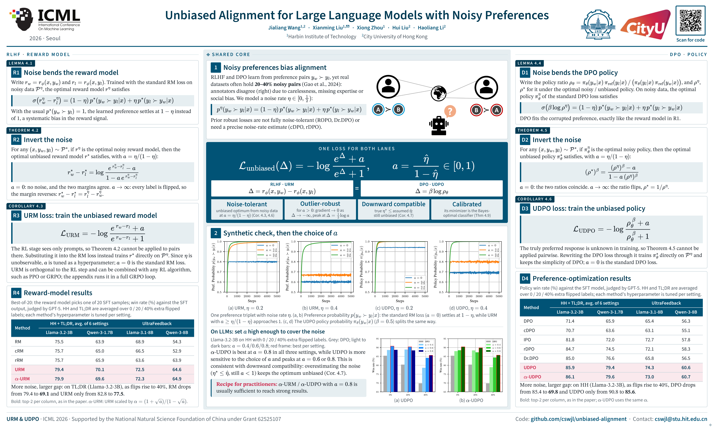

<div align="center">

# Unbiased Alignment

### Unbiased Alignment for Large Language Models with Noisy Preferences

**Official PyTorch Implementation · ICML 2026**

[](https://arxiv.org/abs/2607.03248)
[](https://opensource.org/licenses/MIT)

[Overview](#overview) · [Poster](#poster) · [Usage](#usage) · [Examples](#examples) · [Citation](#citation) · [Contact](#contact)

</div>

---

<a id="overview"></a>

## ✨ Overview

This repository provides training scripts for supervised fine-tuning, direct preference optimization, and reward modeling with noisy preferences.

- **Losses:** Unbiased Reward Model (URM) and Unbiased Direct Preference Optimization (UDPO), including their scaled variants $\alpha$-URM and $\alpha$-UDPO.
- **Noise:** simulated preference noise by randomly swapping chosen and rejected responses.
- **Datasets:** HH-RLHF (helpful subset), TL;DR, and UltraFeedback for preference training; Capybara is also available for supervised fine-tuning.

> [!NOTE]
> In the code, **URM** and **UDPO** use `--loss unbiased`; their scaled variants use `--loss normal_unbiased`.

<a id="poster"></a>

## 🖼️ Poster



<a id="usage"></a>

## 🛠️ Usage

```bash
git clone https://github.com/cswjl/unbiased-alignment.git && cd unbiased-alignment
```

**Core versions:** PyTorch `2.8.0+cu128` · TRL `0.24.0`.

| Setting | Entry point | Datasets |
| :--- | :--- | :--- |
| Supervised fine-tuning (SFT) | [`train_sft.py`](train_sft.py) | `hh`, `tldr`, `capybara` |
| Direct preference optimization (DPO) | [`train_dpo.py`](train_dpo.py) | `hh`, `tldr`, `ufb` |
| Reward modeling | [`train_reward.py`](train_reward.py) | `hh`, `tldr`, `ufb` |

| Argument | Description | Examples |
| :--- | :--- | :--- |
| `--model` | Model name | `qwen1.7b` , `qwen8b`, `llama3b`, `llama8b` |
| `--dataset` | Dataset name | `hh`, `tldr`, `ufb`, `capybara` |
| `--loss` | Loss function (DPO and reward modeling) | `unbiased`, `normal_unbiased`, `sigmoid`, `robust` |
| `--noise_rate` | Flipping  rate | `0`, `0.2`, `0.4` |
| `--para` | Loss parameter; | `0`, `0.4`, `0.8` |

Train an SFT model first. DPO and reward modeling load its checkpoint from `./models/sft_<model>_<dataset>` and save their outputs under `./models/`. For `ufb`, prepare a compatible SFT checkpoint at that path; `train_sft.py` supports the datasets listed above.

> [!NOTE]
> Training requires CUDA with BF16 support. Configure the W&B `entity` and `project` in each training script.
<!-- > Before running DPO, remove the duplicate `optim=args.optim` argument in [`train_dpo.py`](train_dpo.py), keeping `optim="adamw_torch_fused"`. -->

<details>
<summary><strong>📂 Repository structure</strong></summary>

```text
unbiased-alignment/
├── train_sft.py            # Supervised fine-tuning
├── train_dpo.py            # Direct preference optimization
├── train_reward.py         # Reward model training
├── utils.py                # Model aliases, data loading, and preference noise
├── methods/                # Custom trainers and configurations
│   ├── dpo_trainer.py       # DPO losses, including UDPO and its scaled variant
│   ├── dpo_config.py        # DPO configuration
│   ├── reward_trainer.py    # Reward losses, including URM and its scaled variant
│   └── reward_config.py     # Reward model configuration
└── poster.png              # Conference poster
```

</details>

<a id="examples"></a>

## 🚀 Examples

Run SFT first, then choose DPO or reward modeling. The following examples use Qwen3-1.7B on HH-RLHF:

```bash
# Step 1 · Train the SFT checkpoint
python3 train_sft.py --model qwen1.7b --dataset hh

# Step 2 · DPO · 20% added preference noise · α-UDPO
python3 train_dpo.py --model qwen1.7b --dataset hh --noise_rate 0.2 --loss normal_unbiased --para 0.8

# Step 2 (alternative) · Reward modeling · 20% added preference noise · α-URM
python3 train_reward.py --model qwen1.7b --dataset hh --noise_rate 0.2 --loss normal_unbiased --para 0.8
```

### 🧩 Integrate the loss into your own trainer

The core reward loss is implemented in [`methods/reward_trainer.py`](methods/reward_trainer.py):

```python
if self.args.loss_type == "unbiased":
    exp_margin = torch.exp(rewards_chosen - rewards_rejected)
    prob = (exp_margin + self.args.unbiased_a) / (exp_margin + 1)
    loss = -torch.log(prob).mean()

elif self.args.loss_type == "normal_unbiased":
    sqrt_a = self.args.unbiased_a ** 0.5
    normal = (1 + sqrt_a) / (1 - sqrt_a)
    exp_margin = torch.exp(rewards_chosen - rewards_rejected)
    prob = (exp_margin + self.args.unbiased_a) / (exp_margin + 1)
    loss = -torch.log(prob).mean() * normal
```

For DPO, the margin is `self.beta * logits`, where `logits` is the difference between the chosen and rejected policy-to-reference log-probability ratios. See [`methods/dpo_trainer.py`](methods/dpo_trainer.py).

<a id="citation"></a>

## 🎓 Citation

If you find this work useful, please cite our [paper](https://arxiv.org/abs/2607.03248):

```bibtex
@inproceedings{wang2026unbiased,
  title={Unbiased Alignment for Large Language Models with Noisy Preferences},
  author={Wang, Jialiang and Liu, Xianming and Zhou, Xiong and Liu, Hui and Li, Haoliang},
  booktitle={International Conference on Machine Learning},
  year={2026},
  url={https://arxiv.org/abs/2607.03248}
}
```

<a id="contact"></a>

## 📬 Contact

Questions about the paper or code? Contact **Jialiang Wang** at [cswjl@stu.hit.edu.cn](mailto:cswjl@stu.hit.edu.cn).

---

<div align="center">

**⭐ Star us on GitHub — it motivates us a lot!**

</div>
